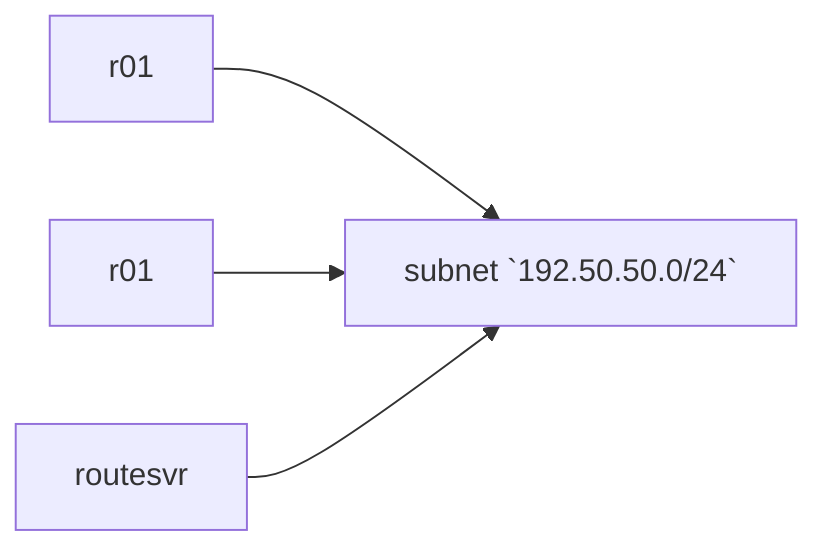

# BGP Routing Playground
This repo provide an easy way to experiment with BIRD Internet Routing Daemon, and GoBGP. 

# Containers
- r01 = GoBGP
- r02 = GPBGP
- routesvr = BIRD

# Diagrams

# How to 
1. Make sure you have a recent version of docker installed
2. run `docker compose up -d` 
3. commands can be executed within the containers using
   - routesvr: use `docker exec -it routesvr birdc` to access the BIRD CLI. From there you can execute commands normally. 
   - r02: use `docker exec r02 gobgpc <command>`
   - r03: use `docker exec r01 gobgp <command>`

# Manually Adding routes into GoBGP 
You can add routes into the GoBGP Routing Information base like this
example:
`docker exec r01 gobgp global rib add -a ipv4 10.10.20.0/21 nexthop 10.10.20.20 identifier 20`

Keep in mind that these route will no longer be advertised after restarting the container!

# Adding routes with script
- Dependencies: Have Python3.10 (or higher) installed on your local machine
1. Add prefixes that you want to add to r01 and r02 into the file `scripts/prefixes.py`. There are a few prefixes already added to the list.
2. Run `python3 scripts/inject_routes.py` 
3. The script will randomly add the routes to r01 and r02 and print out the results. 

Like the manually added routes, these routes will not remain after the container is restarted. 

